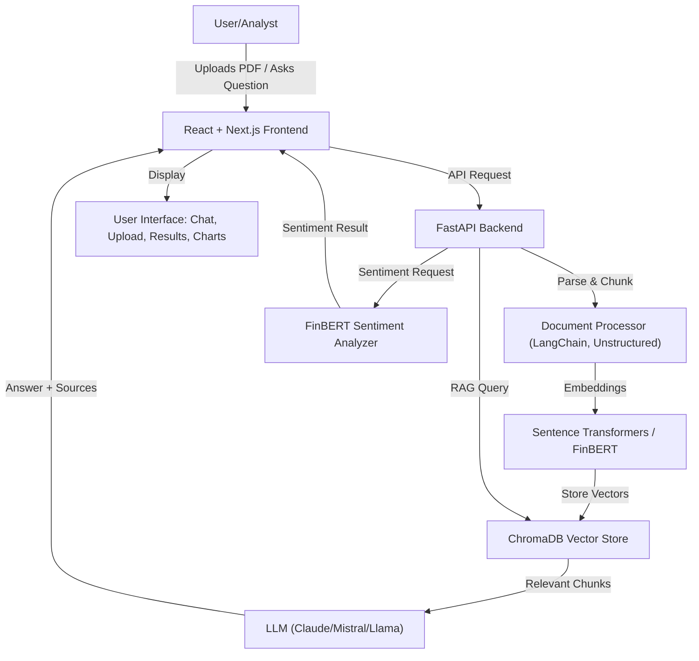

# Financial Analyst Assistant

A powerful AI-powered chatbot that helps analyze financial documents, including 10-K filings, market analysis reports, and financial news articles. Built with state-of-the-art language models and financial analysis tools.

## Features

- 📊 Parse and analyze SEC 10-K filings
- 📈 Extract key financial metrics (EPS, Revenue, Debt ratios)
- 🔍 Intelligent document search and question answering
- 📰 Financial news sentiment analysis
- 📑 PDF document upload support
- 💬 Interactive chat interface

## Tech Stack

### Backend
- FastAPI
- LangChain
- Mistral/Claude for LLM
- FinBERT for sentiment analysis
- ChromaDB for vector storage
- Sentence Transformers for embeddings

### Frontend
- Next.js 14
- React
- Tailwind CSS
- Axios for API calls
- React Dropzone for file uploads

## Prerequisites

1. Python 3.8+
2. Node.js 18+
3. API keys for:
   - Anthropic (Claude)
   - Finnhub (optional)
   - Alpha Vantage (optional)

## Setup

1. Clone the repository:
```bash
git clone <repository-url>
cd Finance-Bot
```

2. Set up the Python virtual environment and install dependencies:
```bash
python -m venv venv
source venv/bin/activate  # On Windows: venv\Scripts\activate
pip install -r requirements.txt
```

3. Create a `.env` file in the root directory with your API keys:
```env
ANTHROPIC_API_KEY=your_anthropic_key
FINNHUB_API_KEY=your_finnhub_key
ALPHA_VANTAGE_API_KEY=your_alphavantage_key
```

4. Install frontend dependencies:
```bash
cd frontend
npm install
```

## Running the Application

1. Start the backend server (from the root directory):
```bash
source venv/bin/activate  # On Windows: venv\Scripts\activate
uvicorn app.main:app --reload
```

2. Start the frontend development server (in a new terminal):
```bash
cd frontend
npm run dev
```

3. Open your browser and navigate to:
   - Frontend: http://localhost:3000
   - API docs: http://localhost:8000/docs

## Usage

1. Upload a financial document (PDF) using the drag-and-drop interface
2. Wait for the document to be processed
3. Ask questions about the document in natural language
4. View responses with relevant citations and sources

## Example Queries

- "What are the main risk factors mentioned in the latest 10-K?"
- "Summarize the Management Discussion and Analysis section"
- "What was the revenue growth compared to last year?"
- "Extract key financial metrics from Q4 2023"
- "Analyze the sentiment of recent news about the company"

## Project Structure

```
.
├── app/                    # Backend
│   ├── api/               # API routes
│   ├── core/              # Core functionality
│   ├── models/            # Data models
│   └── services/          # Business logic
├── frontend/              # React frontend
│   ├── src/
│   │   ├── components/    # UI components
│   │   ├── hooks/        # Custom hooks
│   │   └── services/     # API services
├── models/                # ML model configs
└── scripts/              # Utility scripts
```

## Contributing

1. Fork the repository
2. Create a feature branch
3. Commit your changes
4. Push to the branch
5. Create a Pull Request

## License

MIT 

## 🗺️ Visual Architecture

